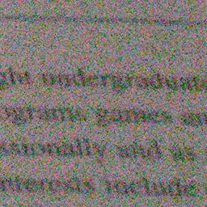
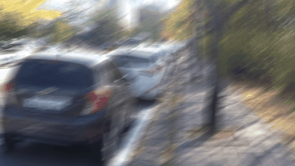
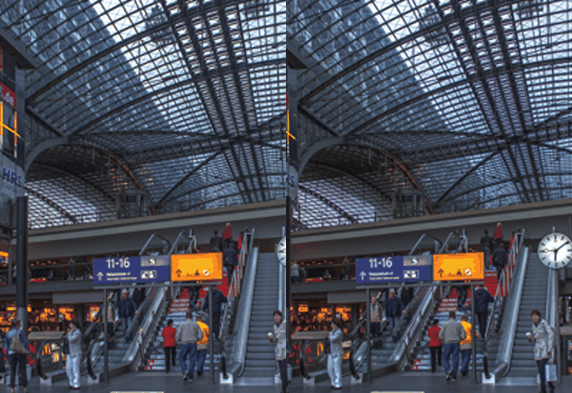

## X-Do Restoration

X-Do Restoration is a generative graphical image restoration model implemented in PyTorch based on the paper **[Simple Baselines for Image Restoration (ECCV2022)](https://arxiv.org/abs/2204.04676)**

#### [Xaindex.ai](https://xaindex.ai)

|  |  |  |
| :----------------------------------------------------------: | :----------------------------------------------------------: | :----------------------------------------------------------: |
|                           Denoise                            |                            Deblur                            |                           StereoSR                           |

### Installation

```python
python 3.9.5
pytorch 1.11.0
cuda 11.3
```

```
clone repo 
cd X-Do\ Restoration
pip install -r requirements.txt
python setup.py develop --no_cuda_ext
```

### Quick Start 
* Single Image Inference Demo:
    * Image Denoise:
    ```
    python basicsr/demo.py -opt options/test/XDD/NAFNet-width64.yml --input_path ./demo/noisy.png --output_path ./demo/denoise_img.png
  ```
    * Image Deblur:
    ```
    python basicsr/demo.py -opt options/test/XDS/NAFNet-width64.yml --input_path ./demo/blurry.jpg --output_path ./demo/deblur_img.png
    ```
    * ```--input_path```: the path of the degraded image
    * ```--output_path```: the path to save the predicted image
    * Stereo Image Super-resolution:
    ```
    python basicsr/demo_ssr.py -opt options/test/XSR/NAFSSR-L_4x.yml \
    --input_l_path ./demo/lr_img_l.png --input_r_path ./demo/lr_img_r.png \
    --output_l_path ./demo/sr_img_l.png --output_r_path ./demo/sr_img_r.png
    ```
    * ```--input_l_path```: the path of the degraded left image
    * ```--input_r_path```: the path of the degraded right image
    * ```--output_l_path```: the path to save the predicted left image
    * ```--output_r_path```: the path to save the predicted right image
